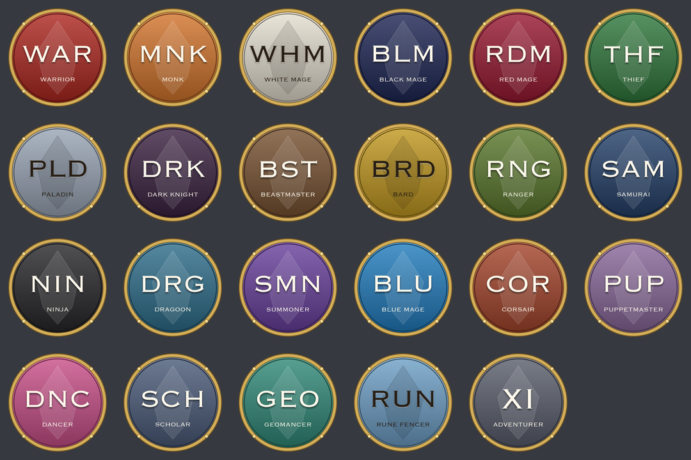

# LandSandBoat Discord bridge

Connects a [LandSandBoat](https://github.com/LandSandBoat/server) FFXI server's chat with Discord,
both ways, and optionally makes Say, Shout and Yell reach every zone, for small servers where the few
players online are rarely in the same place.



- **Game to Discord**: Say, Shout, Yell, linkshells, Unity and the Assist channels, each to the Discord
  channel you choose. Lines are posted as their speaker ("Tagban (RDM75/WHM37)") with a badge for their
  main job, drawn for this project.
- **Discord to game**: what is written in a channel reaches the game as a Say, Shout or Yell (to every
  zone), a server message, a linkshell's chat, Unity chat or an Assist channel.
- **Worldwide chat** (optional): Say, Shout and/or Yell reach everyone, wherever they are.
- **Who's online** in Discord: a roll call every half hour (or as often as you like), only when
  someone is on, with each one's nation, jobs and zone (players set to /anon show their name and
  nation only), or a post for every login and logout if you prefer. `/online` shows it any time.
- **Logins in the game**: "Tagban has logged in." as a server message in every zone, if you like.
- The bot's nickname showing whether the server is up and how many are online, and its status the
  game version the server takes.
- Nothing of LandSandBoat's is changed: a module, a settings file and a table, so its updates don't
  undo it.

Made for [MogHouse](https://moghouse.cc) and shared for any LandSandBoat server.

## How it works

```
 game chat ──> discord_bridge module ──> discord_bridge_chat table ──> bot ──> Discord channels
 Discord   ──> bot ──> world server (IPC, as tools/announce.py) ──> the game's chat
```

- `module/discord_bridge` is a LandSandBoat C++ module. It sees each chat line as it arrives, records
  the kinds you choose in the `discord_bridge_chat` table, and, if you turn it on, sends Say, Shout or
  Yell to every zone (instead of the server's nearby-only copy, so nobody sees a line twice).
- `bot/` is a Discord bot in Python. It posts the recorded lines, and sends Discord's into the game
  through the world server's IPC port, the way LandSandBoat's own `tools/announce.py` does. It reads
  the IPC message numbers from your server's `tools/generate_ipc_stubs.py`, so they follow
  LandSandBoat's updates.

Lines starting with `!` (commands, typed right or not) are never recorded or sent anywhere; lines
starting with `/` (a mistyped command) can be dropped. Party chat, alliance chat and tells are never
recorded.

## Requirements

- A LandSandBoat server from **August 2026 or later** (the IPC's fixed-length encoding).
- Python 3.11 or later where the bot runs (the server's machine, or one that reaches its database and
  its world server's port 54003).
- A Discord application with a bot ([Discord developer portal](https://discord.com/developers/applications)).

## Installing

The step-by-step for LandSandBoat, built from source or with Docker (and a LandSandBoat Docker build
problem worth knowing about), is [docs/USING-WITH-LSB.md](docs/USING-WITH-LSB.md).

### 1. The module (on the server)

Copy `module/discord_bridge` into your server's `modules/` folder, and list it in `modules/init.txt`:

```
discord_bridge/
```

It is C++, so the server has to be built again (as for any C++ module): `cmake --build` as you build
it, or `docker compose build` with Docker. Then copy `settings/discord_bridge.lua` into your server's
`settings/` folder, and choose what you want in it (see [Settings](#settings)).

The table is made by the bot the first time it starts; or import it yourself:
`module/discord_bridge/sql/discord_bridge_chat.sql`.

Restart the map server. Its log says `discord_bridge: on (worldwide say ..., shout ..., yell ...)`.

### 2. Discord

1. At the developer portal, make an application, then under **Bot**: copy its token (Reset Token), and
   turn on **Message Content Intent** (to read the channels whose lines go to the game).
2. Invite it to your Discord server (OAuth2, URL Generator: scopes `bot` and `applications.commands`;
   permissions Send Messages, Add Reactions, Change Nickname, and **Manage Webhooks** for the badges).
3. Turn on Developer Mode (Discord settings, Advanced) to copy ids: your server's, and each channel's.

### 3. The bot

```bash
git clone https://github.com/tagban/lsb-discord-bridge /opt/lsb-discord-bridge
cd /opt/lsb-discord-bridge/bot
python3 -m venv venv && venv/bin/pip install -r requirements.txt
cp config.example.toml config.toml   # then edit it: ids, paths, and a [[bridge]] per channel
```

Put the secrets where `config.toml` looks for them: by default the environment variables
`DISCORD_BOT_TOKEN`, `MARIADB_USER`, `MARIADB_PASSWORD` and `MARIADB_DATABASE`, or a `KEY=value` file
named by `server.env_file` (a Docker setup's `.env` already has the database's). Then run it:

```bash
venv/bin/python bridge.py config.toml
```

and, to keep it running, install `lsb-discord-bridge.service` (systemd; change its paths first).

### Docker

With LandSandBoat's Docker setup, the bot reaches the world server's IPC port once it is published to
the machine only, in `docker-compose.yml`:

```yaml
  world:
    ports:
      - "127.0.0.1:54003:54003"
```

and the database's port (3306) the same way, if it is not published already. Keep the module listed
in the `modules/init.txt` your build uses (an update that resets the checkout resets it too).

## Settings

`settings/discord_bridge.lua`, on the server (restart the map server after a change):

| Setting | Default | |
|---|---|---|
| `ENABLED` | `true` | The module does nothing while false |
| `RECORD_SAY`, `RECORD_SHOUT`, `RECORD_YELL` | `true` | Recorded for the bot |
| `RECORD_LINKSHELL` | `false` | Every linkshell's chat, with its name (the bot posts the ones you list) |
| `RECORD_UNITY`, `RECORD_ASSIST` | `false` | Unity chat; the Assist channels |
| `WORLDWIDE_SAY`, `WORLDWIDE_SHOUT`, `WORLDWIDE_YELL` | `false` | That kind reaches every zone |
| `DROP_SLASH_LINES` | `true` | A line starting with `/` is said to nobody |

`bot/config.toml`, for the bot: see `config.example.toml`, which explains each setting. A channel is a
`[[bridge]]`:

```toml
[[bridge]]
channel = 123456789012345678
from_game = ["SAY", "SHOUT", "YELL"]   # or "LINKSHELL:<name>", "UNITY", "ASSIST_E", ...
to_game = "say"                        # or "shout", "yell", "system", "linkshell:<name>", "unity", "assist_e", ""
logins = true
badges = true
```

Some setups:

- **A small server's one channel** (MogHouse's): `WORLDWIDE_SAY/SHOUT/YELL = true`, and one bridge
  with `from_game = ["SAY", "SHOUT", "YELL"]`, `to_game = "say"`, `logins = true`.
- **Read-only**: `to_game = ""`; the bot does not need Message Content then.
- **A linkshell's channel**: `RECORD_LINKSHELL = true`, and a bridge with
  `from_game = ["LINKSHELL:MyShell"]`, `to_game = "linkshell:MyShell"`.
- **Unity as the world's chat**: `RECORD_UNITY = true`, a bridge with `from_game = ["UNITY"]`,
  `to_game = "unity"` (Discord's lines reach every unity).

## The badges

Each game line is posted through a webhook named for the speaker's main job, with that job's badge as
its picture. The bot makes these itself (it needs **Manage Webhooks** in the channel), keeping up to
ten per channel; or give it one you made (its URL in the variable a bridge's `webhook_env` names), whose
picture it changes as the speaker's job does. Without either, it posts the lines itself.

The badges in `bot/badges` were drawn by `tools/make_job_badges.py` (Pillow): change the colors or the
font and run it to make your own. No game art is used.

## Notes

- Auto-translate phrases show as `[AT]` in Discord.
- The game's font is plain ASCII: Discord's emoji are dropped, accented letters lose their accents.
- A Discord line reaches the game as `Name[D] : text` (the suffix is `name_suffix`); Discord mentions
  from the game are never pings.
- The Discord-to-game side uses LandSandBoat's IPC as it is today; if a LandSandBoat update changes
  the chat messages' fields, the bot's encoders (`bridge.py`, "the game's IPC") change with it.

## announce.py

LandSandBoat's `tools/announce.py` (a server message to every player) stopped working in August 2026,
when its IPC moved to fixed-length encoding. The fix was offered to LandSandBoat
([#11663](https://github.com/LandSandBoat/server/pull/11663)); until your LandSandBoat has it,
[`tools/announce.py`](tools/announce.py) here is the fixed one.

## License

GPL-3.0, as LandSandBoat's (the module is built into the server). See [LICENSE](LICENSE).
